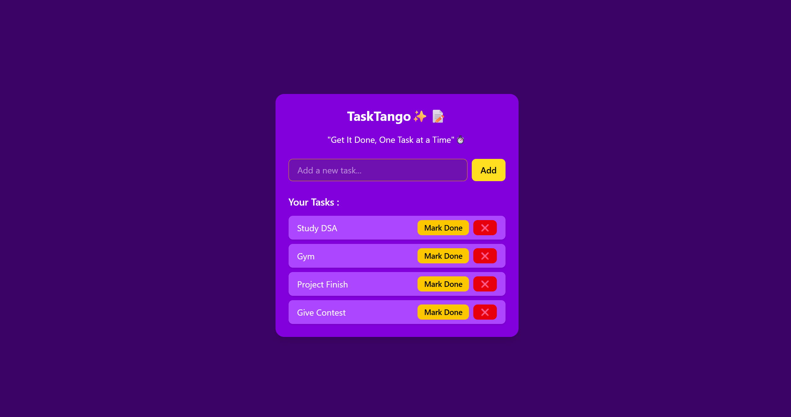
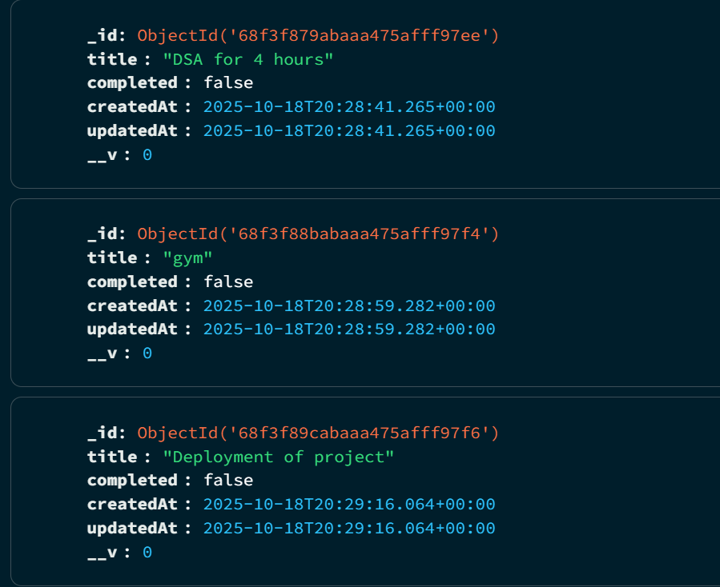

# 📝 TaskTango — Full Stack Todo App

**"Get It Done, One Task at a Time" ⏱️**

TaskTango is a **full-stack Todo application** built with **React, TailwindCSS, Express.js, and MongoDB**.
It allows users to **add, mark as done / undo, and delete tasks** — now with real-time data persistence through a backend API and MongoDB database.

## 🚀 Tech Stack

### 🖥️ Frontend

- React.js
- TailwindCSS
- Axios (for API calls)

### ⚙️ Backend

- Node.js + Express.js
- MongoDB + Mongoose ORM
- dotenv (for environment variables)
- CORS (for connecting frontend & backend)

---

## ✨ Features

### 🌐 Frontend

- ➕ Add new tasks
- ✅ Mark tasks as complete / undo
- ❌ Delete tasks
- 📡 Fetches all tasks from backend API
- 🎨 Responsive and modern UI with TailwindCSS

### 🗄️ Backend

- RESTful API built with Express.js
- Endpoints for:

  - `GET /tasks` — fetch all tasks
  - `POST /tasks` — add a new task
  - `PUT /tasks/:id` — update (toggle completion)
  - `DELETE /tasks/:id` — delete a task

- MongoDB for data persistence

---

## 🏗️ Project Structure

```
TaskTangoApp/
│
├── TaskTangoFrontend/       # React Frontend
│   ├── src/
│   ├── package.json
│   └── ...
│
├── TaskTangoBackend/        # Express + MongoDB Backend
│   ├── src/
│   ├── .env
│   ├── package.json
│   └── ...
│
└── README.md
```

---

## ⚙️ Setup and Installation

### 1️⃣ Clone the repository

```bash
git clone https://github.com/Czar-16/TaskTangoApp.git
cd TaskTangoApp
```

---

### 2️⃣ Backend Setup

```bash
cd TaskTangoBackend
npm install
```

Create a `.env` file inside the backend folder:

```bash
PORT=5000
MONGO_URI=<your-mongodb-connection-string>
```

Start the backend:

```bash
npm run dev
```

Backend will run on → **[http://localhost:5000](http://localhost:5000)**

---

### 3️⃣ Frontend Setup

Open a new terminal:

```bash
cd TaskTangoFrontend
npm install
npm run dev
```

Frontend will run on → **[http://localhost:5173](http://localhost:5173)** (or similar, depending on Vite config)

---

### 4️⃣ Connect Frontend with Backend

Make sure your `api.js` inside the frontend uses the correct backend URL, for example:

```js
const BASE_URL = "http://localhost:5000";
```

---

## 📸 Screenshots

### App Interface



### After Deleting Tasks

.png>)

### Database Image



## 👨‍💻 Author

**Anoop Jha**
✨ "Get It Done, One Task at a Time" ⏱️

---

## 📬 Contact

🔗 **X (Twitter):** [@itsCzar16](https://x.com/itsCzar16)

---
